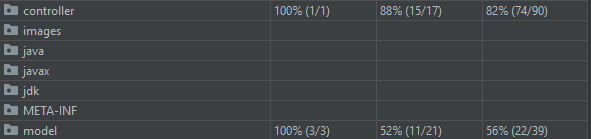
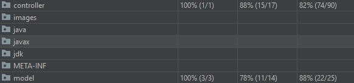

# Documentation

## Scrum Sprint Backlog and Task Estimation

Estimating the sprint backlog benefits the team because it allows them to efficiently manage their workload by breaking down product backlog items into small, distinct tasks and then rough estimating them during sprint planning. This increases the likelihood that the team will complete the task at hand. Additionally, through sprint planning, identifying tasks and predicting them allows team members to work more cooperatively. For example, if sprint backlog items are not estimated, a team will overlook a critical path through the work or the possibility that the person planning the backlog will be the busiest individual during the following iteration.

### Sprint Backlog

| ID        | Task           | Story Points | Justification | 
| :-------------: |:------------| :-----:|:----|
| 01 | Create Models | 1 | This focuses on the project's modelling process by adding Rubric StudentGrade and Criteria models. The estimation of this task is low as it involves short and non-complex implementation.  |
| 02 | Create Controller & Main Class | 1 | Two separate classes must be developed which contain no logic. This task is estimated at one story point as it contains similar complexity as the previous task which should take the same amount of time to complete. |
| 03 | Add logic for adding rubric in Controller  | 2 | This requires creating a new rubric and adding it to the rubric list in the controller. The story points estimation for this task relatively low but higher than the previous two tasks as it involves extensive implementation at a low level of complexity.|
| 04 | Create logic for adding criteria into rubric | 2 | This part involves defining a criteria and subsequently inputting it into a rubric. Due to the similarity in difficulty, the story point calculation is identical to task 3.|
| 05 | Create functionality for retrieving rubrics as a list | 1 | This will involve returning the list of rubrics in the controller class. This is calculated as one story point because, in comparison to tasks 3 and 4, it's completion can be a clear few lines of logic.|
| 06 | Implement getting rubric by name | 3 | This includes accepting a name and checking the list of rubrics to retrieve a match. Error handling should also be included if rubric does not exist. As a result, the estimation is greater than for previous tasks.|
| 07 | Implement creating StudentGrade | 2 | This will involve creating a method that accepts a student name and a rubric to create a StudentGrade. This task has a smaller story point estimate than the previous one and it its estimated at 2 story points because it needs thorough implementation at a low degree of difficulty.|
| 08 | Add logic to add score of criteria into StudentGrade | 5 | This requires the creation of a system that accepts grade criteria and a grade score. Along with the criteria, the score should be added to the grade. This process is more complex than previous tasks since it includes implementation for determining the existence of a grade, the existence of criteria in a rubric, and determining whether the score falls within accepted limits.|
| 09 | Add implementation for getting all the StudentGrades by rubric | 3 | This involves adding a method that accepts a rubric name and returns grades associated with the rubric. It's estimation is 3 story points because it should have some functionality to filter the student grades by rubric. |
| 10 | Implement retrieving summary calculation for rubric | 5 | This will involve creating four methods that return the average, standard deviation, minimum and maximum scores respectively. In contrast to other tasks with a lower estimate, this one will require the implementation of several methods, which explains the high story point estimate.|
| 11 | Implement retrieving summary calculation for criteria | 3 | This task contains similar logic as task 10 but it is sorted differently. This task has less story points since the logic for this task has already been implemented in task 10.|
| 12 | Add implementation of all functionality in the main class | 2 | This will involve simulating a working project by creating a controller with sample data in the main class. The estimation of this task is based on the similarity in assumed time and level of difficulty of tasks 2 and 3. |

Following the completion of tasks Test-Driven Development approach will be used. A test or tests, as well as the code for the task that supports such tests, will be included with the commit to the repository.

&nbsp;

### Velocity Metric

The key metric in Scrum is velocity, which is an indicator of how much work a team can complete in a single Sprint. Velocity is determined by adding the story points for all entirely finished User Stories at the conclusion of the Sprint. Since the metric measures predicted and finished progress over many iterations, the pace will be used to estimate how fast a team can work through the backlog of upcoming sprints. The more sprints the team completes, the more reliable the prediction.

It is critical to monitor the development of velocity over time. New teams will anticipate a boost of velocity when they improve their partnerships and work processes. Existing teams will monitor their velocity to ensure stable results over time and to determine whether or not a specific process adjustment resulted in success. A drop in average velocity is typically indicative of an inadequate aspect of the team's growth phase that can be addressed during the next retrospective.

&nbsp;

## Test-Driven Development

TDD is a software development method that focuses on designing unit test cases before writing the actual code. It's a method that incorporates programming, unit testing, and refactoring in an iterative manner.
The test method is what drives software creation, as the name implies. Furthermore, it is a method of structuring code that allows developers and testers to produce customized code that is long-lasting.

Developers who use TDD begin by writing small test cases for each function based on their initial understanding. This technique's main goal is to only change or write new code if the checks fail. This avoids test scripts being duplicated.

In this project I created the precise tests to verify the functionality of specific features. I made sure that the tests compiled properly and are ready to be executed. Initially, the tests would fail. This is a meaningful failure developed based on my assumption of how the functionality would work.
[This](https://github.com/xtreger/grading-system/pull/9/files) is an example where when a test failed I implemented the method with as little change as possible to ensure that the tests can pass successfully when re-run. I then refactored the code to remove redundancies and optimised the working solution for better performance and cleaner code.

&nbsp;

## Test Coverage Metric

Test coverage refers to the extent to which the tests cover items like test requirements, code, various user case scenarios, and platforms like mobile devices and browsers. It's a good metric for determining how successful the testing process is. Test coverage is critical for detecting flaws before they hit end users.

IntelliJ's test coverage tool was used to determine coverage of tests in this project. IntelliJ IDEA's code coverage feature helps to see how much of the code has been executed. What is useful about this too is that it allows the user to check how much of the code is covered by the unit tests, allowing the user to estimate how accurate they are.

In the following image you can see the results of the test after running the tool for the first time. The coverage of model classes is relatively low due to unused methods.

By analysing the output from the test coverage tool I was able to refactor and clean up the code to better follow the coding standards, improve efficiency and remove unused methods and code. You can see an improved test coverage data below.
Some methods are not 100% covered as they do not require unit test coverage.

&nbsp;

## Team Version-Control
When working with a team on a Git-managed project, it's critical to ensure that everybody is on the same page about how changes will be implemented. An agreed-upon Git workflow should be created or chosen to ensure that the whole team is on the same page.

Initially, the Master and Dev branches are created. While completed tasks can be pushed to the development branch, pushes to the master branch should only be made on new version releases. How the team version-control is followed in this project is that developers start by cloning the development branch and branching off each task separately from that branch. Multiple people can work on the same task and push changes to the remote task branch, but only after pulling any existing changes and resolving conflicts if they exist.

Once the task is complete, developers make a pull request to the dev branch and submit the task for review. Developers reviewing the task should follow the code review checklist and request necessary changes if needed before approving the pull request. Once approved, the branch is merged with the dev branch, and the dev branch subsequently merged into master at release.

The Git-Flow Process was followed in this project as described above. Apart from a situation where if various people worked on different tasks, if there were changes merged to the development branch, other developers would have to pull the changes from the dev branch onto their task branch before merging to resolve any conflicts and ensure that the flow is followed correctly. This example was not present in this project as all tasks were completed in a linear manner because they depended on the previous ones.

## Code-review checklist
Code review is becoming a more prevalent procedure in programming teams. It is a process by which developers apply their code for review and approval prior to combining branches or deploying code to output. This input is typically provided by peers, whether they are other developers, a manager, or a tech lead. The Github pull request is one of the most well-known ways of code review which is used in this project. In it developers leave notes on particular lines of code and eventually accept or refuse the suggested improvements.

By following this checklist developers can ensure that a effective code review process was implemented.

1. **Readability** - In coding, readability refers to the ease with which the code can be understood. In this situation, knowing coding entails being able to quickly identify the code's inputs and outputs, as well as the purpose of each line of code and its relationship to the larger image. When reading the code, you should be able to deduce the purpose of specific functions, procedures, or classes.

2. **Maintainability** - The code is extendable and changeable because it will allow for easier changing in the future. e.g. code is tightly coupled to another system, code relies on other deprecated code.

3. **Performance** - Application performance reflects an emphasis on how rapidly the code executes for the end user. Protracted database queries, unoptimized properties, and numerous API requests may all contribute to the perception of slow code.

4. **Security** - Security problems could be ignored through code review if engineers choose not to place themselves in the shoes of those attempting to hack the device. They must do so by asking the following questions: if I was trying to gain access to the system or steal data, how could I exploit this code?

5. **Documentation** - Determine if the code you're checking needs further documentation. If it's a new idea, this involves creating an appropriate readme file that outlines why it happens and how to use it. If you're adding new code to an existing project, consider whether the project's readme file needs to be changed to reflect the new features or resources.

6. **Scalability** - Consider scalability by considering what might happen to the code you're checking if it was suddenly loaded. When doing code tests, it's critical to understand what could happen to the code across times of very heavy use. After all, the hardest way to find scalability problems is when they result in the failure of the website/app/service to function properly.

7. **Test Coverage and Test Quality** - Software analysis is almost as important for evaluations as it is for the reviewed code. This is because a defective test is more risky than none at all. Passing checks reassures the creator and encourages him or her to bring new code to output. However, what if one of the exams passes for the incorrect cause or fails to measure what it is meant to? This type of test is a ticking time bomb that allows bugs to infiltrate the codebase.

[This](https://github.com/xtreger/grading-system/pull/9) is an example how code review was followed in this project.

